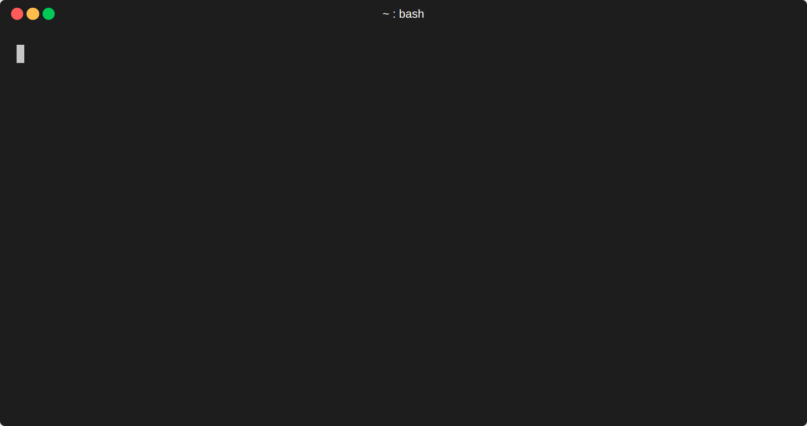

# BONK

A mighty command-line tool for bonking your friends, enemies, or inanimate objects! Keep track of exactly how many times you've bonked anything with persistent cloud-based bonking statistics.



## Features

- 🔨 **BONK** anybody or anything with the power of  your command-line!
- 🖼️ **Display** delightful ASCII art with each successful BONK.
- 🌐 **Cloud-based** bonking memory powered by *counterapi.dev* to spread your bonks around the globe.
- 💨 **Fast** and efficient bonking, written in Go

## Installation

### Method 1: Using a package manager

#### Snap Store


```bash
snap install bonk 
```

#### AUR (Arch User Repository)


```bash
# https://aur.archlinux.org/packages/bonk
yay -S bonk
```

### Method 2: Manually download the binaries
[](https://github.com/KingJorjai/BONK/releases/latest)


You can download the latest release binaries from the [**releases page**](https://github.com/KingJorjai/BONK/releases/).

### Method 3: Building from source

> [!IMPORTANT]
> Is required to have a **Go** installation. 


```bash
# Clone the repository
git clone https://github.com/KingJorjai/BONK.git
cd BONK

# Install the project
go install
```

## Usage

Bonking is as simple as pointing and... well, bonking!

```bash
# Basic usage
BONK <name>

# Examples
BONK keyboard
BONK mondayMornings
BONK bugs
```

### Example Output

```
⠀⠀⠀⠀⠀⠀⢀⣁⣤⣶⣶⡒⠒⠲⠾⣭⡆⠀⠀⠀⠀⠀⠀⠀⠀⠀⠀⠀⠀⠀⠀⠀⠀⠀⠀⠀⠀⠀⠀⠀
⠀⠀⠀⠀⠀⠀⣿⡀⣸⠟⠛⠃⠀⣀⣀⠈⣷⡀⠀⠀⠀⠀⠀⠀⠀⠀⠀⠀⠀⠀⠀⠀⣴⠀⠀⠀⠀⠀⠀⠀
⠀⠀⠀⡠⠂⢠⠏⠀⠉⠀⠀⠀⠰⣿⠟⠀⠙⢧⡀⠀⠀⠀⠀⠀⠀⢀⠀⠀⢀⢀⡀⣼⣧⡾⠃⠀⠀⠀⠀⠀
⢀⠔⠀⣠⠔⠁⠀⠀⠀⠀⠀⠀⠀⠰⢄⡠⣶⢾⣽⡆⠀⠀⠀⠀⠄⢡⡀⢰⣾⣿⡀⠈⠵⠟⠛⠀⠀⠀⠀⠀
⠀⣠⠊⠁⠀⠀⠀⠀⠀⠀⠀⠀⠀⠀⠀⠈⡟⠋⠉⠀⠀⠀⠀⣰⢦⣼⡷⣼⡏⢯⢉⣡⠖⠋⣩⡇⠀⠀⠀⠀
⣰⠁⠀⠀⠀⠀⠀⠀⠀⠀⠀⠀⠀⠀⠀⠀⡇⠀⠀⠀⢺⣿⡄⣿⡄⣿⢿⠈⢁⡴⠋⠀⢀⣴⣋⡀⠀⠀⠀⠀
⡇⠀⠀⢰⠀⠀⠀⠀⠀⠀⠀⠀⠀⠀⠀⠀⣿⠒⢛⣡⣸⡏⢹⡟⠻⠏⢀⡴⠋⠀⣠⣖⠻⠿⠿⣤⡀⠀⠀⠀
⡇⠀⠀⠈⣇⠀⠀⠀⠀⠀⠀⠀⠀⠀⠀⠀⡟⠀⠛⢡⡞⠻⠟⠁⢀⡴⠋⢀⣤⣞⣛⣻⡆⠀⠀⠉⢇⠀⠀⠀
⣇⠀⠀⠀⠈⢦⠀⠀⠀⠀⠀⠀⠀⠀⠀⢠⠇⠀⠠⠏⠀⠀⢀⠴⠋⣀⠴⣿⠛⠛⠁⠈⠁⠀⠀⠀⠈⢧⠀⡄
⠸⡄⠀⠀⠀⠀⡇⠀⠀⢰⠃⠀⠈⣇⠀⠸⣦⡀⠀⠀⢀⡔⠁⣠⠞⠁⠀⡇⠀⠀⠀⠀⠀⠀⠀⠀⠀⢸⡀⠀
⠀⠙⣄⠀⠀⠀⣿⠀⠀⢸⠒⠒⠒⠻⡀⠀⣷⠬⣉⡶⠋⣠⠞⠁⠀⠀⠀⡇⠀⠀⠀⡀⠀⢠⠀⠀⠀⠘⡇⠀
⠀⠀⠈⠑⠦⠤⣽⣄⠀⢸⠤⠤⠤⠤⢷⡀⠸⣷⠋⣠⢾⡁⠀⠀⠀⠀⠀⡇⢠⠇⠀⢹⠀⢸⠃⠀⠀⣸⠃⠀
⠀⠀⠀⠀⠀⠀⠀⢹⠀⢸⠀⠀⠀⠀⠀⢈⠦⣀⣙⣻⡞⠃⠀⠀⠀⢀⡼⢡⠧⠤⠤⢸⠀⣾⠤⠤⠚⠁⠀⠀
⠀⠀⠀⠀⠀⠀⠀⢸⡀⠸⡄⠀⠀⠀⠀⣧⠴⠃⠉⠉⠁⠀⠀⠰⣾⡭⠔⠁⠀⠀⠀⡜⠀⡇⠀⠀⠀⠀⠀⠀
⠀⠀⠀⠀⠀⠀⠀⠀⠳⢤⣼⡆⠀⠀⠀⠀⠀⠀⠀⠀⠀⠀⠀⠂⠄⠀⠀⠀⠀⠀⢰⣥⣴⠃⠀⠀⠀⠀⠀⠀
⠀⠀⠀⠀⠀⠀⠀⠀⠐⠀⠤⠐⠀⠀⠀⠀⠀⠀⠀⠀⠀⠀⠀⠀⠀⠀⠀⠀⠀⠀⠀⠀⠀⠀⠀⠀⠀⠀⠀⠀⠀
You gave bugs a mighty BONK!
bugs has been bonked 42 times! BONK BONK!
```

### Advanced Bonking Techniques

For true bonking connoisseurs, try these pro moves:

```bash
# Bonk scheduled tasks
0 9 * * 1 BONK mondayMornings
```
```bash
# Count how many times you've bonked something
BONK coffee > /dev/null && echo "I need more coffee!"
```
```bash
# Multi-bonking with a for loop
for i in {1..5}; do BONK keyboard; done
```

## Contributing

Pull requests are welcome! Please feel free to BONK this repository with your improvements.

### How to Contribute

1. **Fork** the repository
2. **Clone** your fork locally
3. **Create a branch** for your feature or bugfix (`git checkout -b feature/amazing-bonk`)
4. **Commit** your changes (`git commit -am 'Add some amazing bonking feature'`)
5. **Push** to the branch (`git push origin feature/amazing-bonk`)
6. Create a new **Pull Request**

### Development Setup

```bash
# Get all dependencies
go mod tidy

# Run tests
go test ./...

# Build for development
go build
```

### Contribution Guidelines

- Write clean, readable Go code
- Add tests for new features
- Update documentation when needed
- Follow Go best practices
- Make your BONKs count!

Remember: with great BONK comes great responsibility!

## License

This software is released under the "Bonk As You Please" license (also known as MIT).
